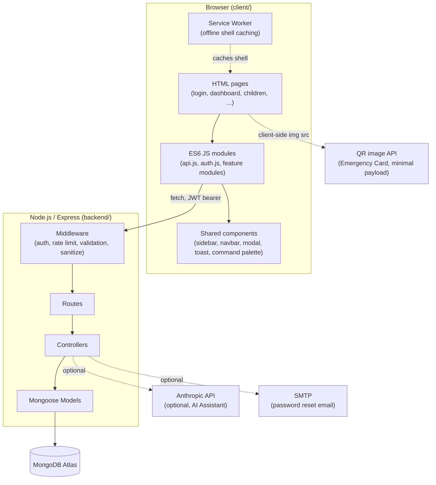
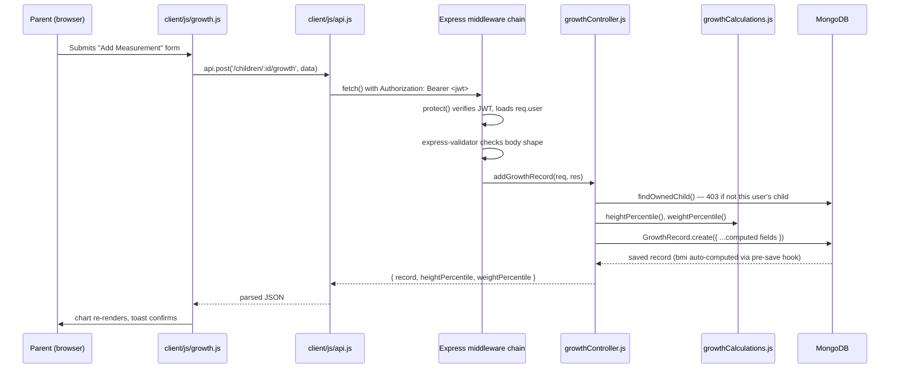

# Architecture

## System Overview



## Why Vanilla JS, No Framework

This is a deliberate choice, not a limitation: no build step means `git clone` → open `index.html` (via any static server) → working app, no `npm run build`, no bundler config, no framework version churn. Every HTML page loads its needed `<script type="module">` directly; ES6 module imports handle code-splitting naturally without tooling. The tradeoff is more manual DOM work in feature modules (`client/js/*.js`) compared to a component framework — accepted deliberately to keep the project approachable and dependency-light.

## Request Flow: Adding a Growth Measurement



## Frontend Module Conventions

Every feature module in `client/js/` (e.g. `growth.js`, `vaccination.js`, `appointments.js`) follows the same shape:

1. **`fetchX(...)`** — thin wrapper around `api.js`, returns parsed data
2. **`xRowHtml(x)` / `xCardHtml(x)`** — pure function, data → HTML string (no DOM mutation, easy to reason about and reuse)
3. **`openAddXModal(...)`** — opens `components/modal.js`, wires its own submit handler, calls an `onSaved` callback so the page decides what to refresh rather than the module reaching back into page-specific DOM

Pages (`client/pages/*.html`) are the composition layer: they call `initApp(pageKey)` once (auth guard + shell + theme + service worker + command palette), then import and wire together whichever feature modules that page needs. No page-to-page shared state beyond `localStorage` (JWT, theme, dashboard widget order) and the URL.

## Backend Layering

```
routes/        → wires HTTP verb + path + middleware chain + controller function
  ↓
middleware/    → auth (JWT verify), validate (express-validator results),
                 upload (multer), auditLogger (fire-and-forget action log)
  ↓
controllers/   → one exported async function per endpoint, wrapped in asyncHandler()
                 so thrown errors reach the global error handler automatically
  ↓
models/        → Mongoose schemas own their own computed fields (e.g. GrowthRecord's
                 BMI pre-save hook, Child's ageInMonths virtual) so correctness doesn't
                 depend on every controller remembering to recompute them
  ↓
utils/         → pure functions with no Express/Mongoose dependency
                 (growthCalculations.js, token.js, email.js) — easy to unit test in isolation
```

**Ownership checks** happen once, in `childController.js`'s `findOwnedChild(req)` helper, reused by every other controller that operates on a child-scoped resource (growth, vaccinations, milestones, nutrition, sleep, appointments, medicines, memories, badges, insights). A parent can only ever touch their own children's data; `role: 'admin'` bypasses the check.

## Data Integrity Philosophy

A few deliberate choices to avoid "the two copies of this number drifted apart" bugs:

- **BMI is a Mongoose pre-save hook** on `GrowthRecord`, not something each controller recomputes — it's structurally impossible to save a record with a stale BMI.
- **NutritionLog's calorie/protein totals are virtuals**, derived from the embedded `meals` array at read time, never stored redundantly.
- **Gamification badges are computed live** (`badgeController.js`) from existing growth/vaccination/milestone/sleep/nutrition data on every request, rather than being a separately-tracked "did we award this yet" table that could fall out of sync.
- **Vaccination schedules and milestone checklists are generated once**, at child-creation time, from the shared config in `backend/config/constants.js` — the same generation function (`generateChildDefaults`) is reused by both the normal "add child" flow and the CSV bulk-import flow, so there's exactly one place that logic lives.

## Deployment Topology

See [DEPLOYMENT.md](../DEPLOYMENT.md) for full steps. Summary: the frontend is static (deployable to any CDN/static host) and the backend is a standard stateless Node/Express process (deployable to any Node host) talking to MongoDB Atlas. They can share one origin (Express serves the static files directly — see the "single-origin option" in the deployment guide) to sidestep CORS entirely, or run as two separate origins with `CLIENT_URL` configured for CORS.
