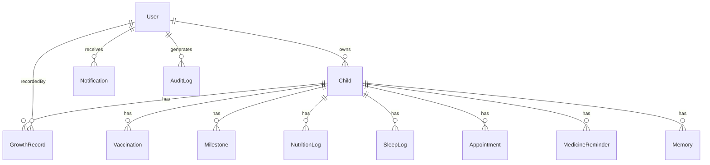

# Database Documentation

MongoDB via Mongoose. 11 collections, all defined in `backend/models/`. Relationships are simple ObjectId references (no embedded arrays of full documents, except where noted) — kept flat and indexed for straightforward queries rather than deeply nested documents.

## Entity Relationship Overview

---

## User

| Field | Type | Notes |
|---|---|---|
| `name` | String | required |
| `email` | String | required, unique, lowercase |
| `password` | String | required, bcrypt-hashed, `select: false` by default |
| `role` | `'parent'` \| `'admin'` | default `'parent'` |
| `avatar` | String | uploaded file path, nullable |
| `phone` | String | nullable |
| `isActive` | Boolean | default `true`; admins can deactivate accounts |
| `theme` | `'light'` \| `'dark'` | synced from the frontend toggle |
| `lastLoginAt` | Date | |
| `passwordChangedAt` | Date | used to invalidate JWTs issued before a password change |

**Hooks:** `pre('save')` hashes the password (bcrypt, cost 12) whenever it's set/changed. `toJSON` strips `password` and `__v`.

---

## Child

| Field | Type | Notes |
|---|---|---|
| `parent` | ObjectId → User | required, indexed |
| `name`, `gender`, `dateOfBirth` | | required |
| `photo` | String | uploaded file path |
| `bloodGroup` | enum | default `'Unknown'` |
| `birthWeightKg`, `birthHeightCm` | Number | nullable |
| `medicalConditions`, `allergies` | [String] | |
| `emergencyContact` | `{ name, relationship, phone }` | |
| `doctor` | `{ name, clinic, phone }` | |
| `isArchived` | Boolean | soft-delete flag; deleted children are never hard-removed |

**Virtual:** `ageInMonths` — computed from `dateOfBirth`. Guarded against being computed on a partially-populated document (e.g. `.populate('child', 'name photo')` omits `dateOfBirth`) — see the inline comment in the model for why this matters.

**Index:** `{ parent: 1, isArchived: 1 }`

---

## GrowthRecord

| Field | Type | Notes |
|---|---|---|
| `child` | ObjectId → Child | required, indexed |
| `recordedBy` | ObjectId → User | |
| `date`, `heightCm`, `weightKg` | | required |
| `headCircumferenceCm` | Number | nullable |
| `bmi` | Number | **server-computed**, never trust a client-supplied value |
| `percentile` | Number | computed at write time from the simplified reference model (see `backend/utils/growthCalculations.js`) |
| `weightStatus` | enum | `Underweight` / `Healthy weight` / `Overweight` / `Obese` |
| `notes` | String | |

**Hook:** `pre('save')` recalculates `bmi` whenever `heightCm` or `weightKg` changes.

**Index:** `{ child: 1, date: -1 }`

---

## Vaccination

| Field | Type | Notes |
|---|---|---|
| `child` | ObjectId → Child | required, indexed |
| `vaccine`, `doseLabel` | String | |
| `dueDate` | Date | required |
| `status` | `'upcoming'` \| `'completed'` \| `'missed'` | |
| `completedDate`, `administeredBy` | | |
| `reminderSent` | Boolean | reserved for a future reminder-notification job |

**Index:** `{ child: 1, dueDate: 1 }`

On child creation, the full schedule in `backend/config/constants.js` (`VACCINE_SCHEDULE`) is auto-instantiated with due dates computed from `dateOfBirth`.

---

## Milestone

| Field | Type | Notes |
|---|---|---|
| `child` | ObjectId → Child | required, indexed |
| `domain` | `'Motor Skills'` \| `'Language'` \| `'Social Skills'` \| `'Cognitive Skills'` | |
| `title`, `expectedAgeMonths` | | required |
| `achieved`, `achievedDate` | | |

Auto-instantiated from `MILESTONE_LIBRARY` in `backend/config/constants.js` on child creation, same pattern as vaccinations.

**Index:** `{ child: 1, domain: 1 }`

---

## NutritionLog

One document per child per day, with an embedded array of meals (the one place this schema embeds sub-documents, since meals are always accessed together with their parent day).

| Field | Type | Notes |
|---|---|---|
| `child`, `date` | | required |
| `meals` | `[{ name, type, calories, proteinG }]` | embedded, `type` ∈ breakfast/lunch/dinner/snack |
| `waterIntakeMl` | Number | |

**Virtuals:** `totalCalories`, `totalProteinG` — derived by summing `meals`, never stored, so they can't drift out of sync.

**Index:** `{ child: 1, date: -1 }`

---

## SleepLog

| Field | Type | Notes |
|---|---|---|
| `child`, `date`, `hoursSlept`, `quality` | | required |
| `napHours` | Number | default 0 |
| `notes` | | |

**Index:** `{ child: 1, date: -1 }`

---

## Appointment

| Field | Type | Notes |
|---|---|---|
| `child`, `title`, `dateTime` | | required |
| `doctorName`, `location`, `reason`, `notes` | | |
| `status` | `'scheduled'` \| `'completed'` \| `'cancelled'` | |

**Index:** `{ child: 1, dateTime: 1 }`

---

## MedicineReminder

| Field | Type | Notes |
|---|---|---|
| `child`, `medicineName` | | required |
| `dosage`, `timeOfDay`, `notes` | | |
| `frequency` | enum | once/daily/twice-daily/thrice-daily/weekly/as-needed |
| `startDate`, `endDate` | | |
| `isActive` | Boolean | default `true` |
| `lastTakenAt` | Date | updated by the "mark taken" action |

**Index:** `{ child: 1, isActive: 1 }`

---

## Memory

| Field | Type | Notes |
|---|---|---|
| `child`, `title`, `date` | | required |
| `type` | enum | first-steps/first-words/birthday/photo/note/other |
| `description` | | |
| `photo` | String | uploaded file path, nullable |

**Index:** `{ child: 1, date: -1 }`

---

## Notification

| Field | Type | Notes |
|---|---|---|
| `user` | ObjectId → User | required, indexed |
| `child` | ObjectId → Child | nullable |
| `type` | enum | vaccination/growth/appointment/medicine/system |
| `title`, `message` | | required |
| `isRead` | Boolean | |
| `dueAt` | Date | nullable — used to filter "today's reminders" on the dashboard |

**Index:** `{ user: 1, isRead: 1, createdAt: -1 }`

---

## AuditLog

Write-only, append-only log of significant actions (logins, CRUD on children/records, admin actions, report downloads).

| Field | Type | Notes |
|---|---|---|
| `user` | ObjectId → User | nullable (some system actions have no user) |
| `action` | String | e.g. `'LOGIN'`, `'CHILD_CREATED'`, `'GROWTH_RECORD_DELETED'` |
| `entityType`, `entityId` | | nullable |
| `ip` | String | |
| `metadata` | Mixed | free-form extra context per action type |

**Index:** `{ createdAt: -1 }`

Writes go through `backend/middleware/auditLogger.js`'s `logAction()` helper, which is fire-and-forget — a logging failure never blocks the actual user-facing action.
